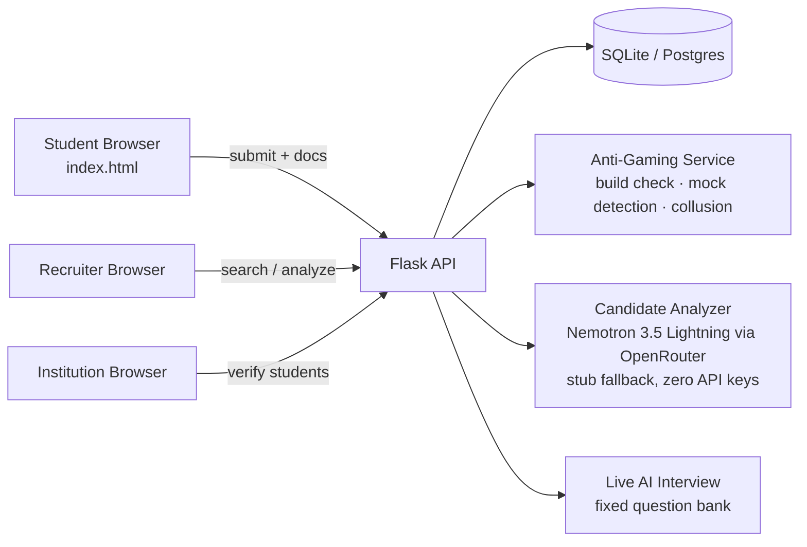
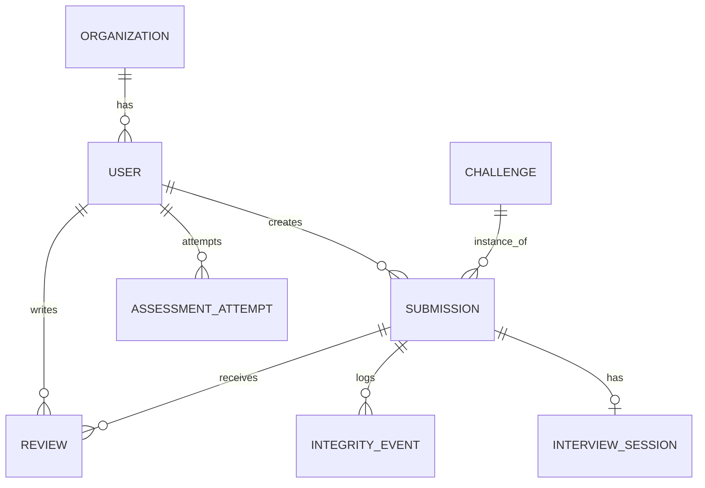

# Architecture

[← Back to README](../README.md)

## System Diagram

## Request Walkthrough

*Trace: a student submits a challenge solution.*

1. Student fills in `github_url`, `architecture_doc`, `decisions`, `explanation` and POSTs to `/api/submissions`.
2. The API runs `check_reproducibility()` (build check) and `check_github_mocking()` (repo age vs. commit heuristic) before anything else.
3. If the challenge is a calibration challenge and the build passed, the student is marked `is_calibrated` (cold-start handling).
4. `analyze_submission()` runs the AI candidate analyzer (or its offline stub) and stores a JSON summary.
5. `recompute_proof_score()` computes `Base × Difficulty × Recency × Breadth`; a failed build zeroes the score outright.
6. Recruiters discover the submission through `/api/recruiter/candidates`, filterable by proof score, technical score, integrity, skill, tag and AI role-fit.

## Components

| Component | Responsibility | Tech | Code location |
|---|---|---|---|
| Frontend | Role-based dashboard (student/expert/recruiter/institution tabs) | HTML/CSS/JS | `src/templates/`, `src/static/` |
| API | REST endpoints for auth, submissions, reviews, recruiter search, dashboards | Flask + Flask-JWT-Extended | `src/routes/` |
| Anti-gaming | Build check, GitHub-mocking heuristic, reviewer-collusion check, cold-start calibration | Python | `src/services/anti_gaming.py` |
| Candidate analyzer | AI role-fit + strengths/risk summary per submission | Python + OpenRouter (Nemotron 3.5 Lightning), stub fallback | `src/services/candidate_analyzer.py` |
| Live AI interview | Fixed rubric-driven question bank; human reads transcript | Python | `src/routes/interview.py` |
| Data store | Persists users, orgs, challenges, submissions, reviews, assessments | SQLAlchemy (SQLite dev / Postgres prod) | `src/models.py` |

## Data Model

| Entity | Key fields | Notes |
|---|---|---|
| Organization | id, name, type, verified | Institution or company account |
| User | id, role, skills, institution_id, verified_by_institution, is_calibrated | role ∈ {student, expert, recruiter, institution} |
| Challenge | id, difficulty, tags, is_calibration | is_calibration flags cold-start ground-truth challenges |
| Submission | id, github_url, scores (technical/architecture/review/integrity/explanation), proof_score, build_passed, github_flag | Core evidence unit |
| Review | id, technical, architecture, debugging, explanation | Structured rubric score from an expert |
| Assessment / AssessmentAttempt | id, duration_minutes, sent_to | Timed test, self-initiated or sent by a recruiter/institution |
| Ranking (derived) | — | Computed live via `recompute_proof_score()`, not stored redundantly |

## Key APIs

| Method | Endpoint | Purpose | Auth |
|---|---|---|---|
| `POST` | `/api/auth/login` | Issue a JWT | anonymous |
| `POST` | `/api/submissions` | Create a submission (runs anti-gaming + AI analysis) | student token |
| `POST` | `/api/submissions/<id>/build-check` | Re-run the build check | token |
| `POST` | `/api/submissions/<id>/integrity-event` | Log a flagged event, never auto-reject | token |
| `POST` | `/api/reviews/<submission_id>` | Submit a rubric review (collusion-checked) | expert token |
| `GET` | `/api/recruiter/candidates` | Search/filter/sort candidates by verified signals | recruiter token |
| `GET` | `/api/dashboard/submission/<id>/explain` | "Why this rank?" full score breakdown | token |
| `POST` | `/api/institution/students/<id>/verify` | Institution vouches for a student | institution token |
| `POST` | `/api/interview/<submission_id>/start` | Start the live AI interview | token |

## Tech Stack

| Layer | Choice | Why this over alternatives |
|---|---|---|
| Frontend | Vanilla HTML/CSS/JS | Zero build step for a hackathon demo; Next.js-ready if the team scales it later |
| Backend | Python Flask | Fast to iterate on for a 3-day hackathon; single shared AI client pattern |
| Database | SQLite (dev) → Postgres (prod) | SQLAlchemy ORM makes the swap a one-line `DATABASE_URL` change |
| AI | Nemotron 3.5 Lightning via OpenRouter, with a deterministic stub | Runs the full demo with zero API keys; upgrades transparently when a key is set (details in [ai.md](../ai.md#3-ai-inside-the-product-runtime)) |
| Hosting | Any Flask-compatible host (Render/Railway/Fly.io) | Single-process app, no infra dependencies for the MVP |

## Data Sources

| Dataset | Source & licence | Real or synthetic | Used for |
|---|---|---|---|
| Demo users, challenges, submissions | Generated by `seed.py` | Synthetic | Local demo / judging |
